<p align="center">
  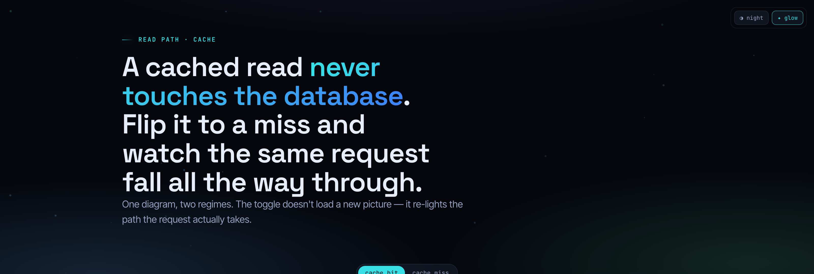
</p>

<h1 align="center">UltraExplainer</h1>

<p align="center">
  <b>Turn code, systems, diffs, plans, data, and concepts into one strikingly clear, self-contained HTML page.</b><br>
  The same explanation, re-skinned by a <b>chameleon studio</b> of seven distinct design languages — chosen to fit the subject, not a house style.<br>
  Node-edge graphs · annotated diffs · honest charts · interactive models · step-throughs · themed Mermaid · slide decks.
</p>

<p align="center">
  <a href="LICENSE"></a>
  
  
  
</p>

---

Ask your coding agent to explain an architecture, review a diff, audit a plan, teach a concept, or build a tunable model. Instead of ASCII art and wrapped terminal tables, UltraExplainer generates **one self-contained `.html` file** — real typography, routed connectors, honest charts, custom illustrations, and live interactivity — and opens it in your browser.

```
> /ultra-explain the auth request flow
> /diff-review main..HEAD
> /plan-review ~/docs/refactor-plan.md
> /dashboard gateway latency this week
> /concept teach me how a Bloom filter works
> /slides the gateway migration
```

## One explanation, seven design languages

The biggest idea in v2: a **stable component contract** sits under **seven complete design languages**. The same `.ux-diff` is an IDE gutter under *Terminal*, a ruled callout under *Blueprint*, a figure under *Editorial*. The skill **picks the language to fit the subject** — glow is one option (*Luminous*), never the default. Below is the *same* cache explainer, re-skinned:

<table>
  <tr>
    <td width="50%">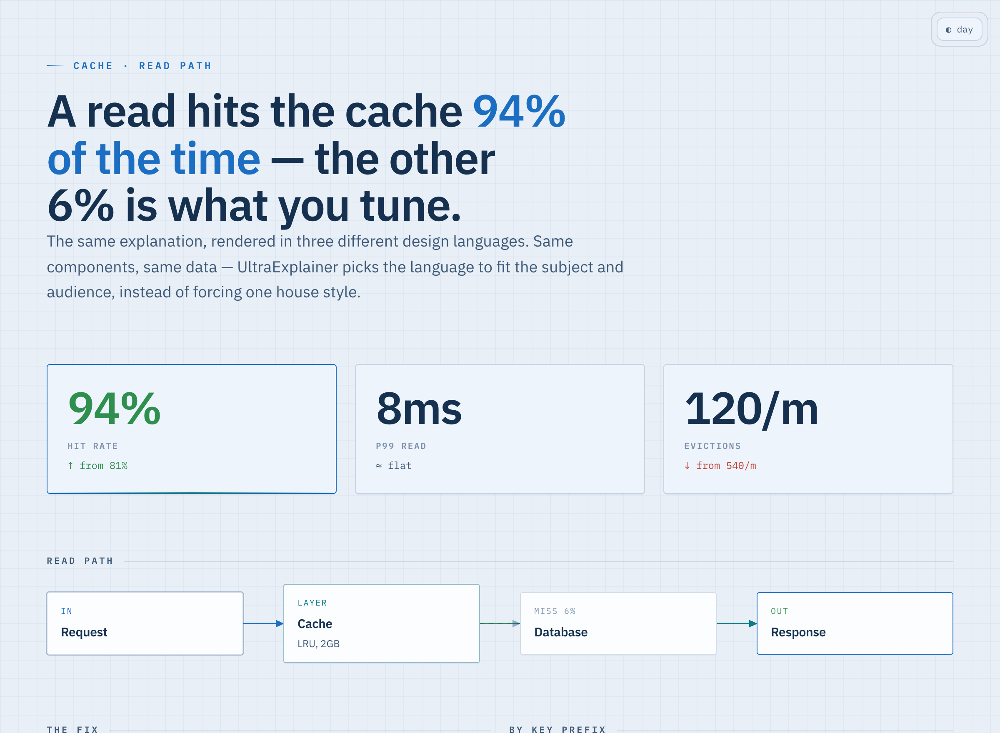<br><sub><b>Blueprint</b> — cyanotype, IBM Plex, dimensioned. Architecture, schemas, protocols.</sub></td>
    <td width="50%">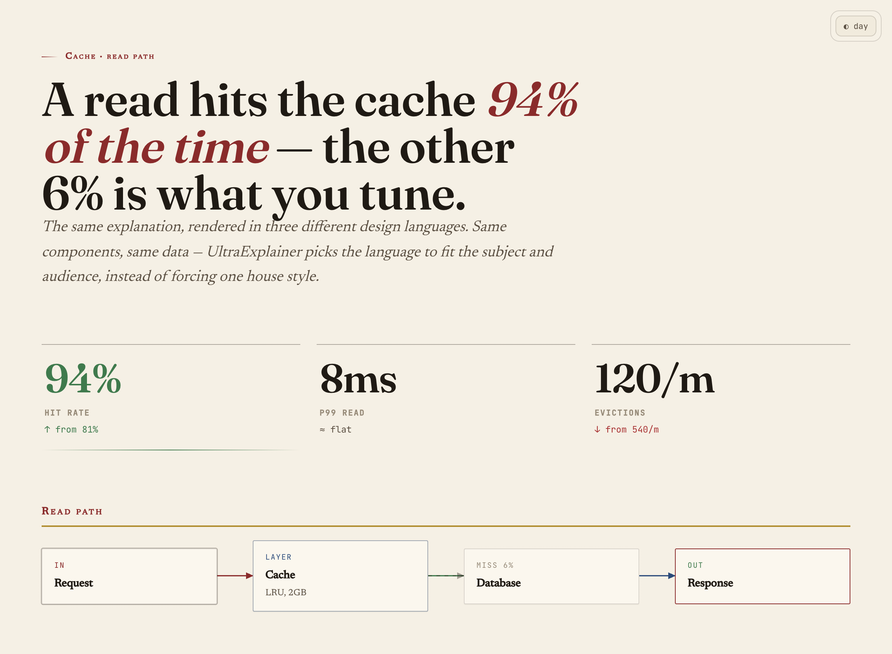<br><sub><b>Editorial</b> — Fraunces serif, warm paper, oxblood. Concepts, ADRs, exec narratives.</sub></td>
  </tr>
  <tr>
    <td>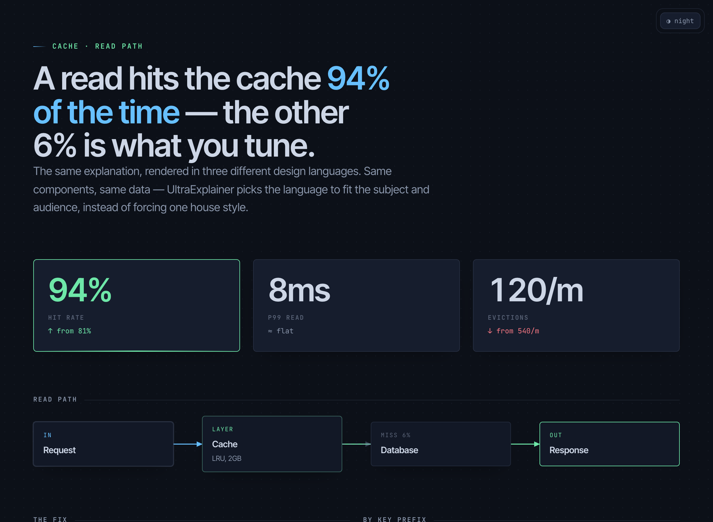<br><sub><b>Terminal</b> — near-black, syntax-token accents. Diffs, PRs, CLI, CI, logs.</sub></td>
    <td>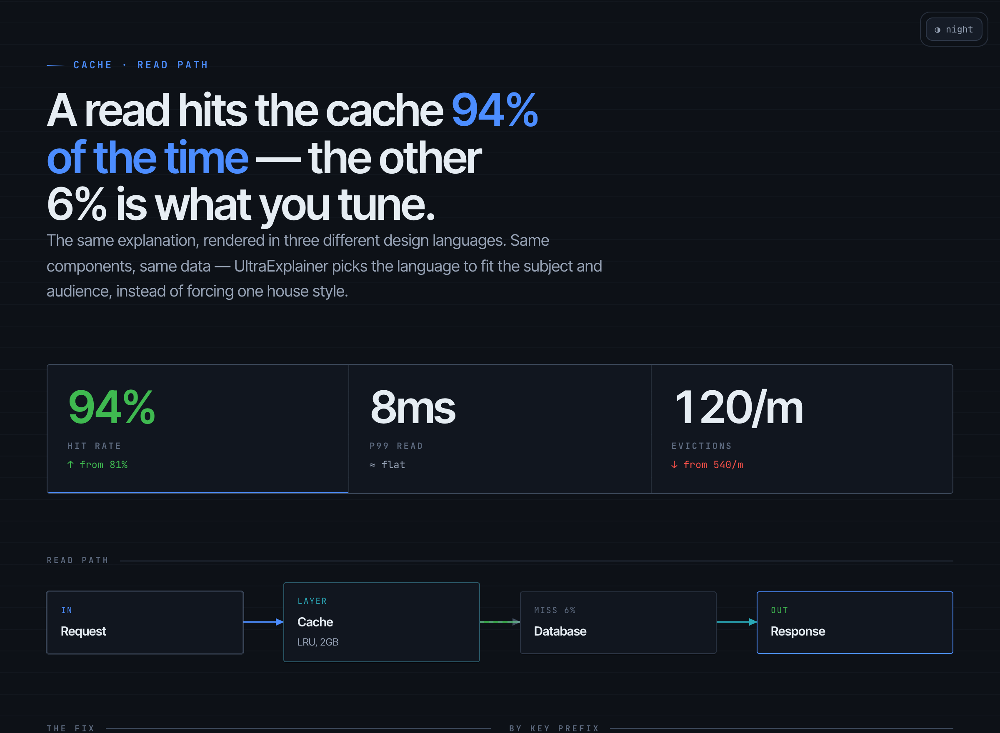<br><sub><b>Instrument</b> — KPI masthead, dense tabular-nums. Metrics, benchmarks, audits.</sub></td>
  </tr>
  <tr>
    <td>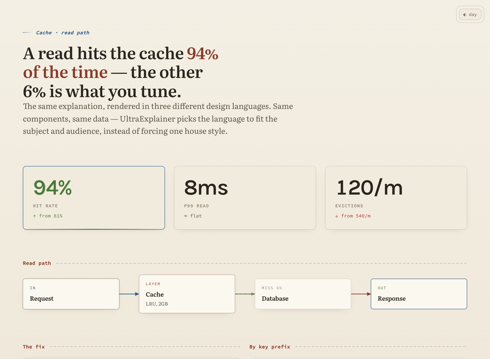<br><sub><b>Notebook</b> — cream paper, sidenotes, Literata. Teaching, walkthroughs, onboarding.</sub></td>
    <td>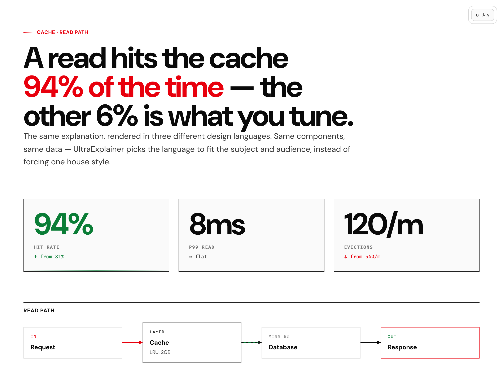<br><sub><b>Swiss</b> — white, one accent, oversized numerals. Comparisons, status, decks.</sub></td>
  </tr>
  <tr>
    <td colspan="2" align="center">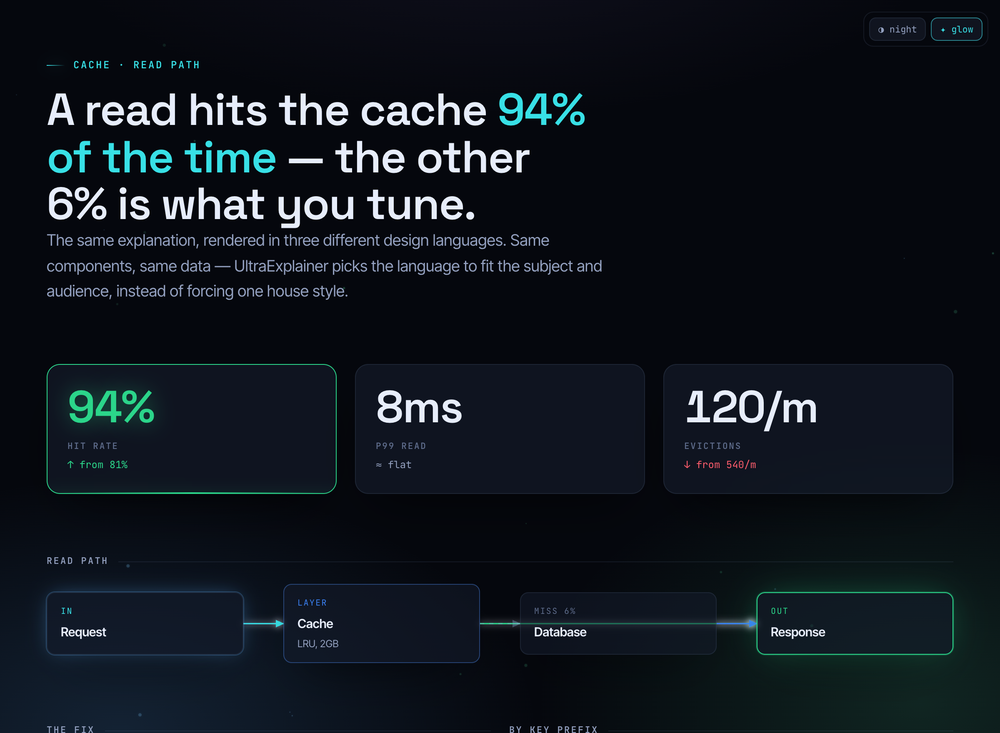<br><sub><b>Luminous</b> — glass + budgeted glow + particle field. System-flow demos, vision pieces. <i>Never the default.</i></sub></td>
  </tr>
</table>

<p align="center"><sub>Every page ships a corner switcher: <b>◑ night / ◐ day</b> — and, on Luminous, <b>✦ glow / ○ flat</b>.</sub></p>

## What's new in v2

A ground-up overhaul of the design and the method:

- **Chameleon studio (7 languages), not one skin.** v1 collapsed into a single dark "Aurora" glow identity. v2 decouples *structure* from *skin*: one semantic component contract, seven swappable theme packs, chosen on the merits. A Blueprint, an Editorial, and a Terminal page are instantly different objects (the squint test).
- **Real interactivity.** A shared state→render engine powers **sliders** (parameter models you can tune), **scenario toggles** (re-light one diagram for hit/miss, flag on/off), **step-throughs** (code↔data in lockstep), and **sortable / filterable** tables — all dependency-free.
- **EXPLAIN vs TEACH modes.** Thesis-first for reviewers; question-first (concrete-before-abstract, predict-then-reveal, a closing transfer check) for learners.
- **Honest charts & interaction-as-evidence.** Every slider range/function is anchored or stamped *"illustrative model"*; charts carry a numbers ledger and axis-honesty rules. An interactive lie is the cardinal sin.
- **Three delivery gates.** **TRUTH** (anchored, reconciled) · **CRAFT** (the squint test) · **OBSERVED** (the page was actually rendered and checked) — truth wins every tie.
- **Self-contained, fonts fall back cleanly.** Pages stay one file; webfonts have full system fallbacks so a blocked CDN never breaks the layout.

## Gallery

<table>
  <tr>
    <td width="50%">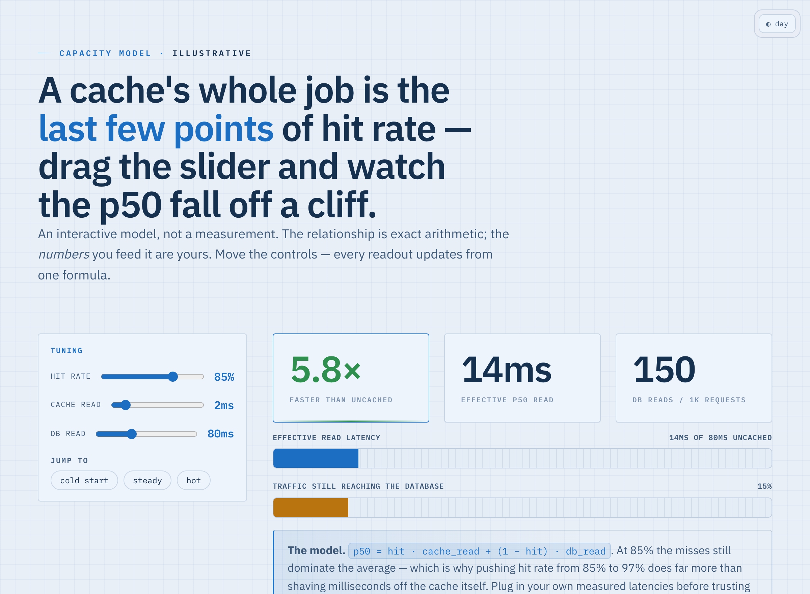<br><sub><b>Parameter model</b> — sliders + bound KPIs/bars; tune the cache, watch p50 move</sub></td>
    <td width="50%">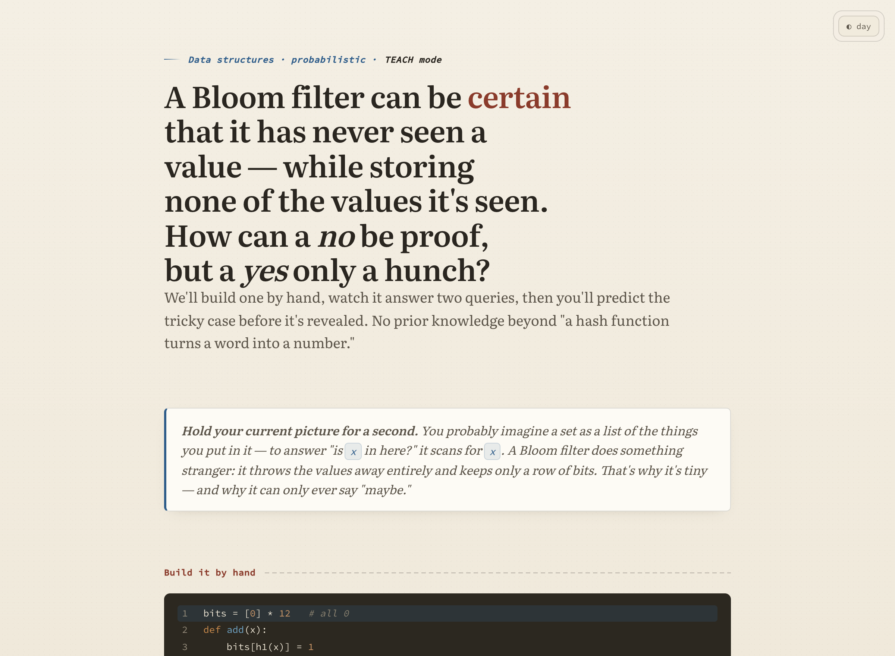<br><sub><b>TEACH mode</b> — step-through, predict-then-reveal, transfer check</sub></td>
  </tr>
  <tr>
    <td>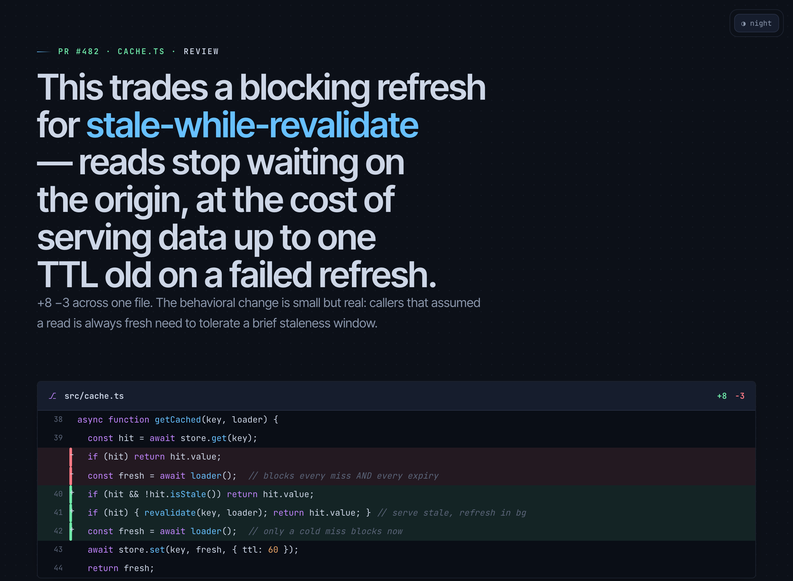<br><sub><b>Diff / PR review</b> — annotated hunks, verdict, blast-radius graph</sub></td>
    <td>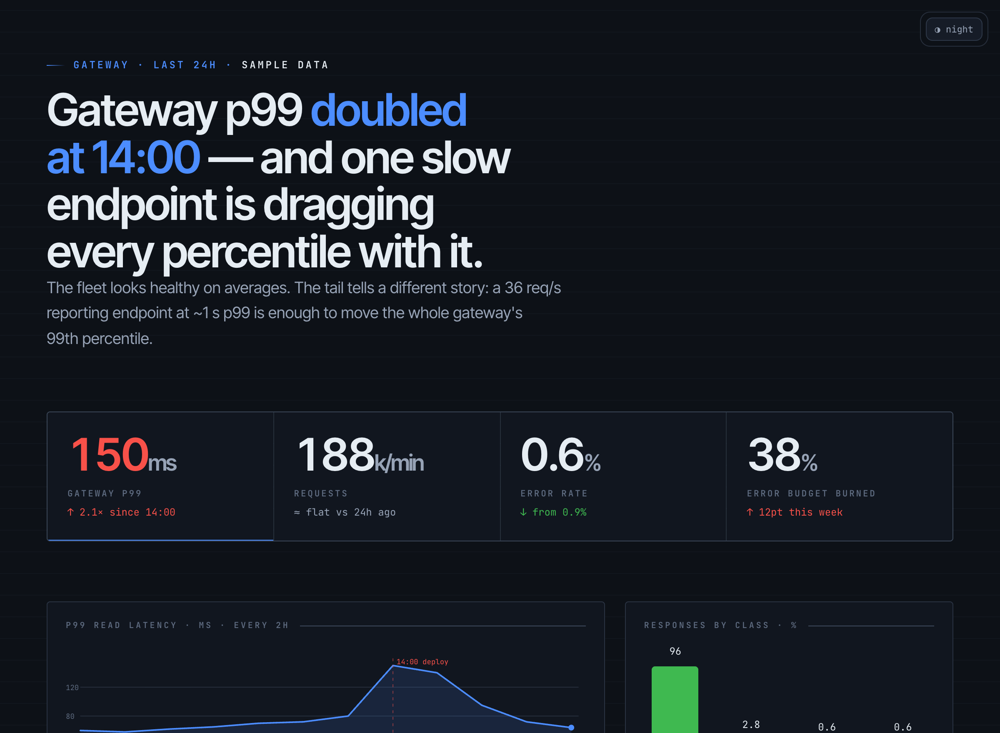<br><sub><b>Dashboard</b> — KPI masthead, honest line/bar charts, sortable table</sub></td>
  </tr>
  <tr>
    <td>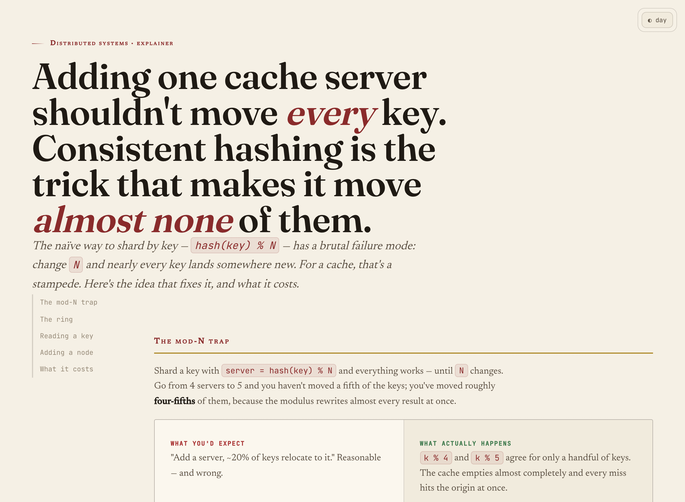<br><sub><b>Concept</b> — scroll-spy nav, custom SVG, naive-vs-correct, sidenotes</sub></td>
    <td><br><sub><b>Comparison</b> — decision matrix, oversized stats, sortable, marked pick</sub></td>
  </tr>
  <tr>
    <td colspan="2" align="center">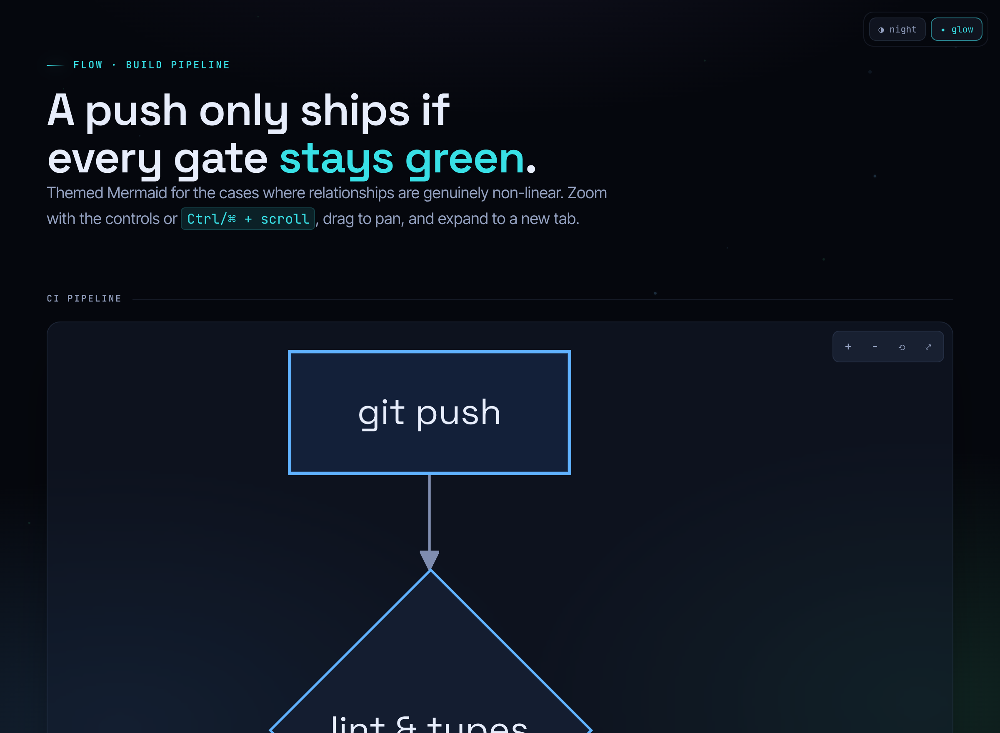<br><sub><b>Mermaid</b> — themed flowcharts with zoom / pan / expand</sub></td>
  </tr>
</table>

## Why another explainer?

Every coding agent defaults to box-drawing characters the moment you ask for a diagram, and to pipe-and-dash walls the moment you ask for a table. UltraExplainer is built to be decisively better — and better than the generic clean-card HTML explainers that already exist — on three axes:

- **The right design language, not a theme.** Seven complete languages chosen on subject × audience × medium and recorded as an auditable decision. Not a wall of identical cards, not uniform neon.
- **A reasoning method, not just rendering.** Before drawing: a one-line *charter* (with EXPLAIN/TEACH mode), a *thesis with tension*, an *evidence ledger* with `file:line` anchors and confidence, a *reconcile gate*, *salience tiering* (≤3 things in the first viewport), the *lowest-ink representation*, and an in-loop *truth audit*. Pretty-but-wrong is a failed deliverable.
- **Verified, not asserted.** The skill renders the page, screenshots it at desktop and mobile, captures console errors, and checks for overflow before handing it over.

> UltraExplainer is an independent, from-scratch project inspired by the excellent [`visual-explainer`](https://github.com/nicobailon/visual-explainer) by nicobailon. It shares the "self-contained HTML, opens in your browser" spirit and goes further on multi-aesthetic design, interactivity, and synthesis rigor.

## Install

### Claude Code (recommended)

```
/plugin marketplace add hookdump/UltraExplainer
/plugin install ultra-explainer@ultraexplainer
```

Then restart, and the `ultra-explainer` skill plus the commands (`/ultra-explain`, `/diff-review`, `/plan-review`, `/dashboard`, `/concept`, `/slides`, `/web-diagram`, `/project-recap`, `/fact-check`) are available. The skill also triggers automatically when you ask for a diagram, review, dashboard, or visual explanation.

### Other harnesses

| Harness | How |
|---|---|
| **Codex CLI** | Copy `plugins/ultra-explainer` to `~/.codex/skills/ultra-explainer`; see `configs/codex/AGENTS.md` |
| **OpenCode** | Copy `plugins/ultra-explainer` to `~/.config/opencode/skill/ultra-explainer`; see `configs/opencode/AGENTS.md` |
| **Cursor** | Add `configs/cursor/ultra-explainer.mdc` to your project rules |
| **Anything else** | Point your agent at `plugins/ultra-explainer/SKILL.md` |

The output is a single HTML file that opens in any browser — no runtime dependencies.

## Commands

| Command | Does |
|---|---|
| `/ultra-explain <thing>` | Explain any system, file, change, or idea — picks the language + representation |
| `/diff-review [range]` | Visual diff/PR review: decisive hunks, behavioral delta, blast radius, verdict |
| `/plan-review <plan>` | Audit a plan/requirements against the codebase, point by point |
| `/dashboard <metrics>` | Metrics dashboard: focal KPI + the leanest honest charts |
| `/concept <topic>` | Teach a mechanism with a custom SVG illustration + worked example |
| `/web-diagram <thing>` | A standalone node-edge graph or themed Mermaid diagram |
| `/slides <topic>` | A full-viewport slide deck |
| `/project-recap` | A context-switch recap from git history + the code |
| `/fact-check <page>` | Re-verify a generated page against the live source |

## The seven design languages

| Language | Character | Use for |
|---|---|---|
| **Blueprint** | Cyanotype ink-on-graph, IBM Plex, dimensioned callouts | Architecture, schemas, protocols, infra |
| **Editorial** | Magazine whitepaper, Fraunces + Newsreader, oxblood + gold | Concepts, ADRs, post-mortems, exec narratives |
| **Terminal** | Developer IDE, JetBrains Mono, syntax-token accents | Diffs, PRs, CLI tools, CI pipelines, logs |
| **Instrument** | Bloomberg-terminal precision, KPI masthead, tabular-nums | Metrics, benchmarks, audits, dashboards |
| **Notebook** | Tufte field-notebook, Literata + Karla, sidenotes | Teaching, walkthroughs, onboarding |
| **Swiss** | International Typographic Style, one accent, oversized numerals | Comparisons, principles, status reports, decks |
| **Luminous** | Glass + budgeted glow + particle field (fully toggleable to flat) | System-flow demos, vision pieces — never by default |

## How it's built

```
plugins/ultra-explainer/
├── SKILL.md                  # the skill: method + language/representation routing + invariants
├── commands/                 # 9 slash-command modes
├── references/               # synthesis-method, aesthetic-languages, component-contract,
│                             #   representations, interactivity, charts-honesty, teaching,
│                             #   playbooks, self-contained, mermaid, slides
├── templates/                # 10 self-contained example pages (the build output)
│   └── _src/                 # body fragments + per-template head/foot sidecars
└── assets/
    ├── core.css              # the design-language-agnostic component contract (semantic tokens only)
    ├── themes.css            # the seven theme packs (fill the tokens per data-theme-preset)
    └── ux.js                 # state→render engine, connector graph, switcher, tabs, sort/filter, scroll-spy
```

A page is assembled from a body fragment whose first line is a directive selecting the language:

```bash
node scripts/build.mjs <name>     # inlines core.css + themes.css + ux.js into templates/<name>.html
```

```html
<!--ux: {"title":"…","preset":"blueprint","theme":"light"} -->
```

`preset` picks one of the seven languages; `presets:["…"]` emits one file per language (the chameleon demos). The generated pages are fully self-contained — open them straight from disk.

## License

MIT © [hookdump](https://github.com/hookdump). See [LICENSE](LICENSE).
