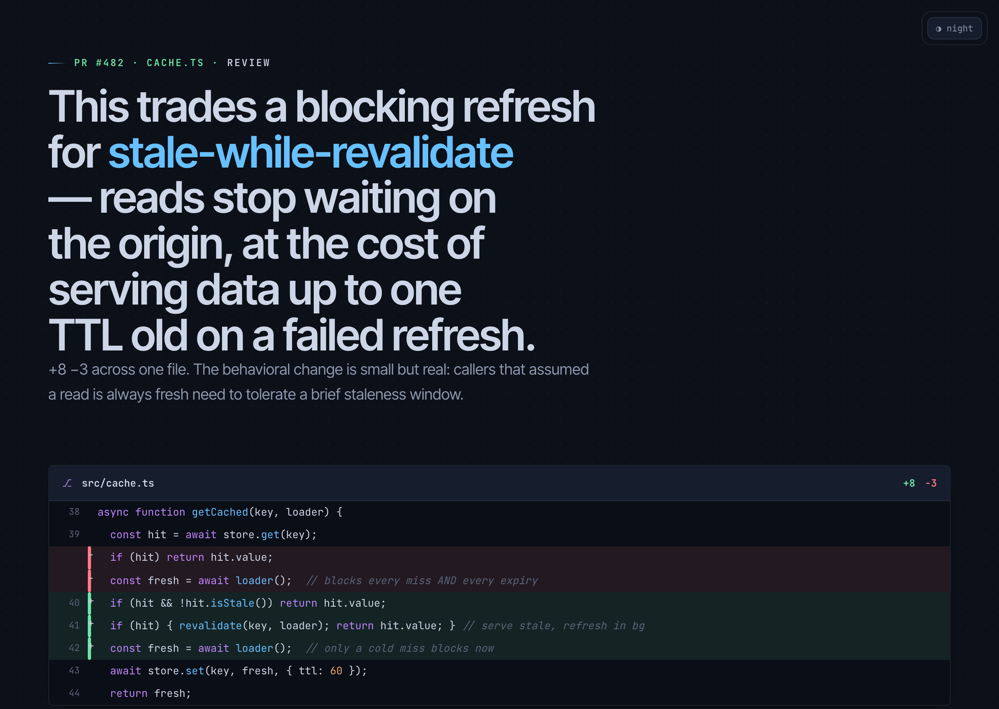
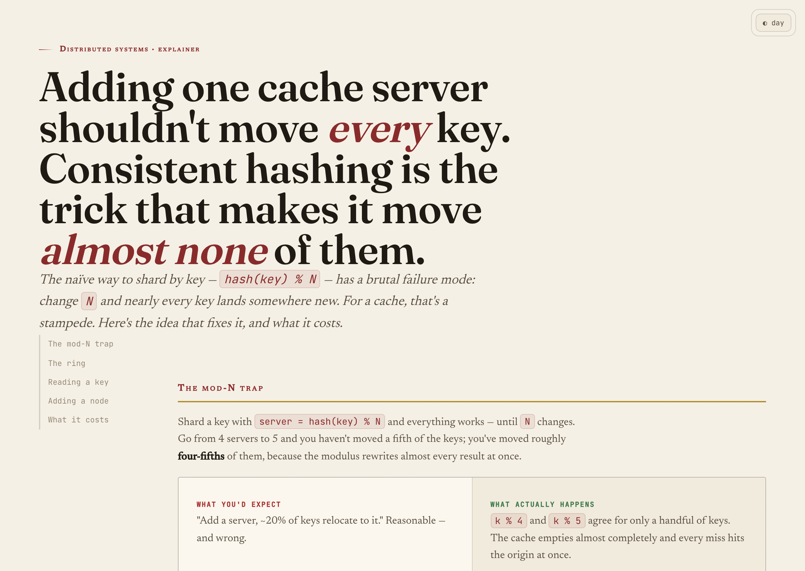
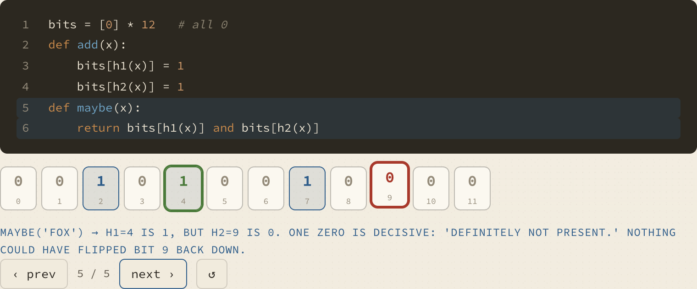
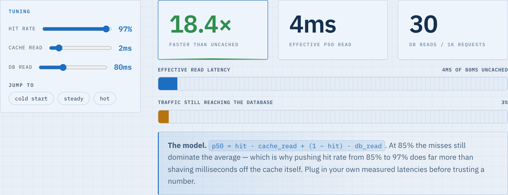
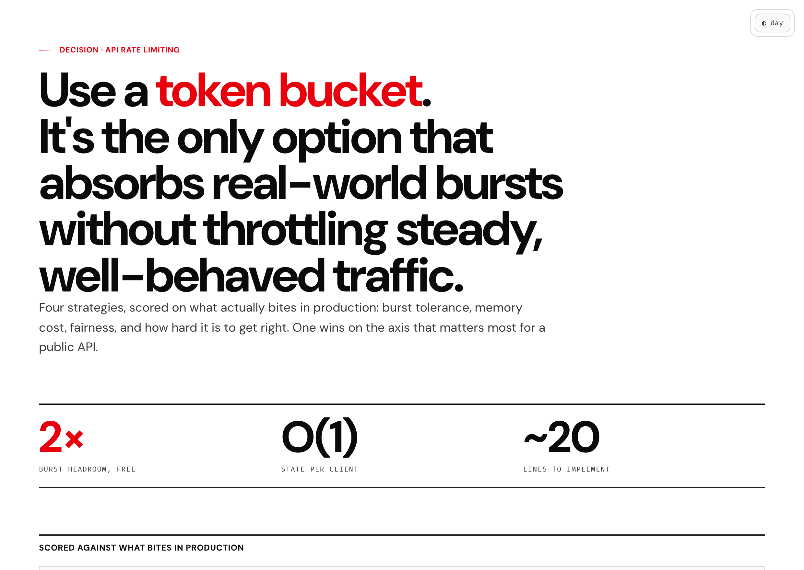
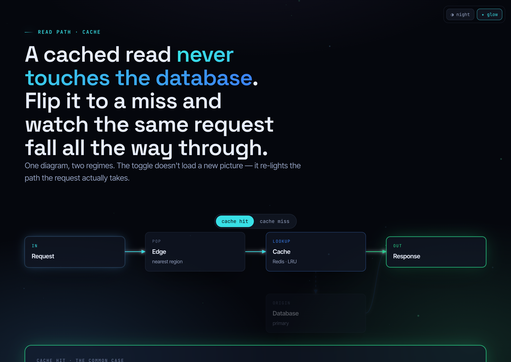

<p align="center">
  
</p>

<h1 align="center">UltraExplainer</h1>

<p align="center">
  <b>Turn code, systems, diffs, plans, data, and concepts into strikingly clear, self-contained HTML.</b><br>
  Node-edge graphs with routed arrows · annotated diffs · honest charts · custom SVG · themed Mermaid · interactive explorables · slide decks.<br>
  Rendered in a <b>chameleon studio</b> of seven distinct design languages — chosen to fit the subject, not forced into one house style.
</p>

<p align="center">
  <a href="LICENSE"></a>
  
  
</p>

---

Ask your coding agent to explain an architecture, review a diff, audit a plan, teach a concept, or build an explorable model. Instead of ASCII art and wrapped terminal tables, UltraExplainer generates **one self-contained `.html` file** — real typography, routed connectors, charts, custom illustrations, and working interactivity — and opens it in your browser.

```
> /ultra-explain the auth request flow
> /diff-review main..HEAD
> /plan-review ~/docs/refactor-plan.md
> /dashboard recovery performance this month
> /concept teach me how a Bloom filter works
> /slides the gateway migration
```

## Why another explainer?

Every coding agent defaults to box-drawing characters the moment you ask for a diagram, and to pipe-and-dash walls the moment you ask for a table. UltraExplainer is built to be **decisively better than that — and better than the generic clean-card HTML explainers that already exist** — on three axes:

- **A chameleon studio, not a theme.** A stable, design-language-*agnostic* component contract (`core.css`) is re-skinned by **seven complete design languages** (`themes.css`): **Blueprint, Editorial, Terminal, Instrument, Notebook, Swiss, Luminous**. The skill *chooses* the language on the merits of subject × audience × medium and records why. The same diff renders as an IDE gutter under Terminal, a ruled callout under Blueprint, or a figure under Editorial. Glow is **one** language (Luminous), never the default; light/dark always toggle. From across the room, a Blueprint, an Editorial, and a Terminal page are instantly *different objects* — that's the bar.
- **A reasoning method, not just rendering.** Before drawing, the skill writes a one-line *charter*, picks a *mode* (EXPLAIN vs TEACH), forms a *thesis with tension*, harvests evidence into a *ledger with anchors and confidence*, runs a *reconcile gate*, tiers everything by *salience*, then asks "should the reader *feel* this by changing an input?" before choosing the lowest-ink representation. Three gates govern delivery — **TRUTH** (every node/edge/number/slider-range is anchored or visibly hedged), **CRAFT** (the squint test), and **OBSERVED** (the page was actually rendered and checked). Pretty-but-wrong is a failed deliverable; truth wins every tie.
- **Real interactivity, honestly built.** One shared state→render engine powers sliders, scenario toggles, step-through players, and sortable/filterable tables — so a static diagram becomes a little simulator the reader can operate. Every range and every input→output function is anchored to real config or stamped *"illustrative model."*

> UltraExplainer is an independent, from-scratch project inspired by the excellent [`visual-explainer`](https://github.com/nicobailon/visual-explainer) by nicobailon. It shares the "self-contained HTML, opens in your browser" spirit and goes further on multi-aesthetic design, interactivity, and synthesis rigor.

## Gallery

<table>
  <tr>
    <td width="50%"><br><sub><b>Terminal</b> — PR review: annotated diff + verdict + blast-radius graph</sub></td>
    <td width="50%"><br><sub><b>Instrument</b> — KPI masthead, honest line/bar charts, sortable table</sub></td>
  </tr>
  <tr>
    <td><br><sub><b>Editorial</b> — concept explainer: custom SVG, naive-vs-correct, scroll-spy nav</sub></td>
    <td><br><sub><b>Notebook</b> — TEACH mode: a step-through player (here, the decisive step)</sub></td>
  </tr>
  <tr>
    <td><br><sub><b>Blueprint</b> — interactive parameter model: sliders drive every readout</sub></td>
    <td><br><sub><b>Swiss</b> — decision matrix: oversized numerals + sortable comparison</sub></td>
  </tr>
  <tr>
    <td><br><sub><b>Luminous</b> — system flow: routed graph + scenario toggle + optional glow</sub></td>
    <td><br><sub><b>Mermaid</b> — themed flowcharts with zoom / pan / expand</sub></td>
  </tr>
</table>

<p align="center"><sub>The banner above is the <b>same</b> cache explanation rendered in all seven languages. Every page ships a corner switcher (<b>◑ night / ◐ day</b>; Luminous adds <b>✦ glow / ○ flat</b>).</sub></p>

## Install

### Claude Code (recommended)

```
/plugin marketplace add hookdump/UltraExplainer
/plugin install ultra-explainer@ultraexplainer
```

Then restart. The `ultra-explainer` skill plus the commands (`/ultra-explain`, `/diff-review`, `/plan-review`, `/dashboard`, `/concept`, `/slides`, `/web-diagram`, `/project-recap`, `/fact-check`) are available, and the skill also triggers automatically when you ask for a diagram, review, dashboard, or visual explanation.

### Other harnesses

| Harness | How |
|---|---|
| **Codex CLI** | Copy `plugins/ultra-explainer` to `~/.codex/skills/ultra-explainer`; see `configs/codex/AGENTS.md` |
| **OpenCode** | Copy `plugins/ultra-explainer` to `~/.config/opencode/skill/ultra-explainer`; see `configs/opencode/AGENTS.md` |
| **Cursor** | Add `configs/cursor/ultra-explainer.mdc` to your project rules |
| **Anything else** | Point your agent at `plugins/ultra-explainer/SKILL.md` |

No build step to *use* a page and no runtime dependencies — output is a single HTML file that opens in any browser.

## Commands

| Command | Does |
|---|---|
| `/ultra-explain <thing>` | Explain any system, file, change, or idea — picks the language and representation |
| `/diff-review [range]` | Visual diff/PR review: decisive hunks, behavioral delta, blast radius, verdict |
| `/plan-review <plan>` | Audit a plan/requirements against the codebase, point by point |
| `/dashboard <metrics>` | Metrics dashboard: focal KPI + the leanest honest charts |
| `/concept <topic>` | Teach a mechanism (TEACH mode) — worked example, step-through, predict-then-reveal |
| `/web-diagram <thing>` | A standalone node-edge graph or themed Mermaid diagram |
| `/slides <topic>` | A full-viewport slide deck |
| `/project-recap` | A context-switch recap from git history + the code |
| `/fact-check <page>` | Re-verify a generated page against the live source |

## The chameleon studio

A two-layer architecture decouples **structure** from **skin**:

- **`core.css` — the component contract.** Every `.ux-*` component (thesis, panel, KPI, node-edge graph, diff, table, charts, stepper, sliders, sidenotes…) is styled only against *semantic tokens* (`--bg`, `--surface`, `--text`, `--accent`, `--good/warn/bad`, `--edge`, fonts…) and an optional `--fx-*` glow layer. Components never hard-code a color.
- **`themes.css` — seven theme packs.** Each fills those tokens for a complete design language (palette, type pairing, grain, radius, signature component overrides) in both light and dark tunings. Switching `data-theme-preset` re-skins every component at once.
- **`ux.js` — the runtime.** A FOUC-free theme/glow switcher, the connector engine (routes bezier arrows between nodes, re-routes on resize, hover-to-trace), tabs, table sort + live filter, scroll-spy nav, and the shared **state→render engine** that drives sliders, scenario toggles, and step-through players. Every subsystem auto-inits and is a no-op when its markup is absent.

Pages are **flat-first** (glow is a removable `--fx-*` layer, Luminous only), responsive to 360px with no horizontal scroll, and respect `prefers-reduced-motion`, `prefers-color-scheme`, keyboard focus, and print.

## How it's built

```
plugins/ultra-explainer/
├── SKILL.md                  # the skill: method + language/representation routing + invariants
├── commands/                 # 9 slash-command modes
├── references/               # synthesis-method · aesthetic-languages · component-contract
│                             # representations · interactivity · teaching · charts-honesty
│                             # playbooks · self-contained · mermaid · slides
├── templates/                # 10 self-contained example pages (build output)
│   └── _src/                 # body fragments + per-template head/foot sidecars + directive
└── assets/
    ├── core.css              # design-language-agnostic component contract
    ├── themes.css            # the seven theme packs
    └── ux.js                 # switcher · connector engine · state→render engine · sort/filter · nav
```

Each template is assembled from the canonical assets so the look stays consistent:

```bash
node scripts/build.mjs <name>   # inlines core.css + themes.css + ux.js into templates/<name>.html
```

The generated pages are fully self-contained — open them straight from disk.

## License

MIT © [hookdump](https://github.com/hookdump). Inspired by [nicobailon/visual-explainer](https://github.com/nicobailon/visual-explainer) (also MIT).
