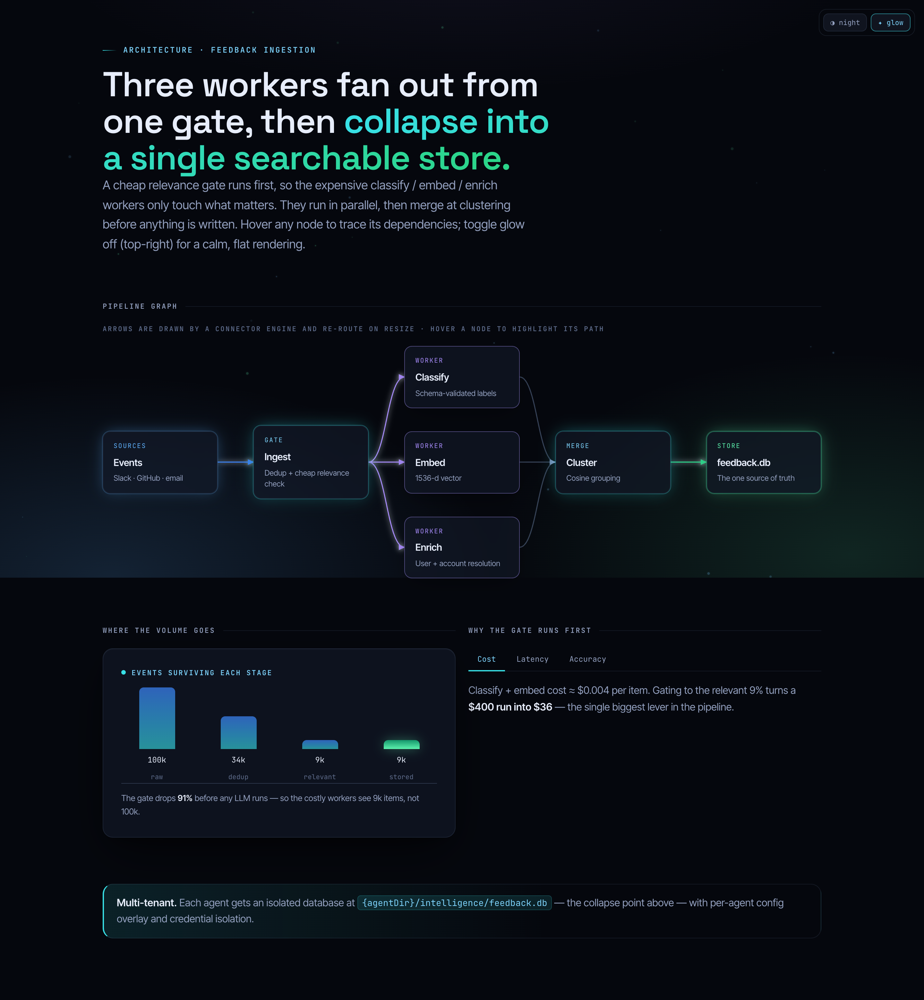
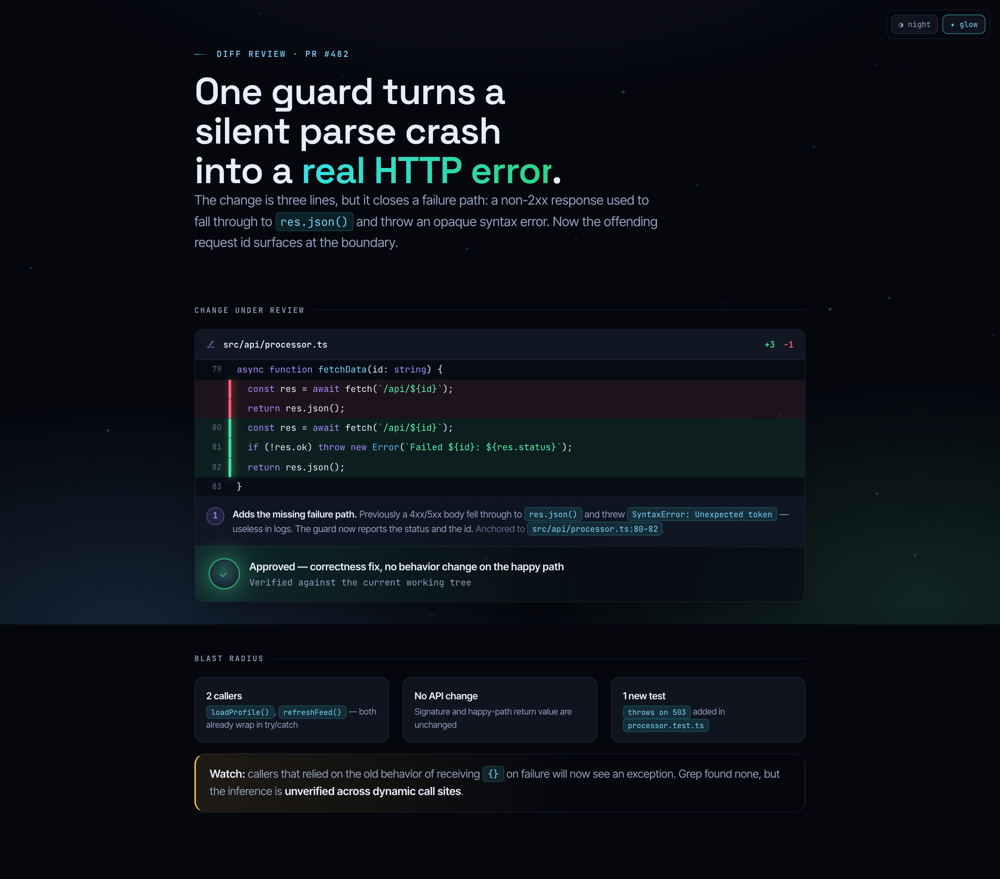
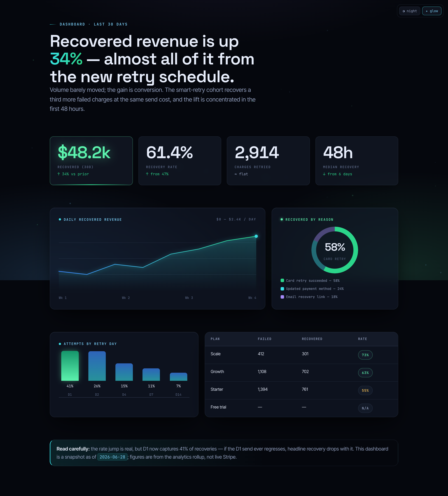
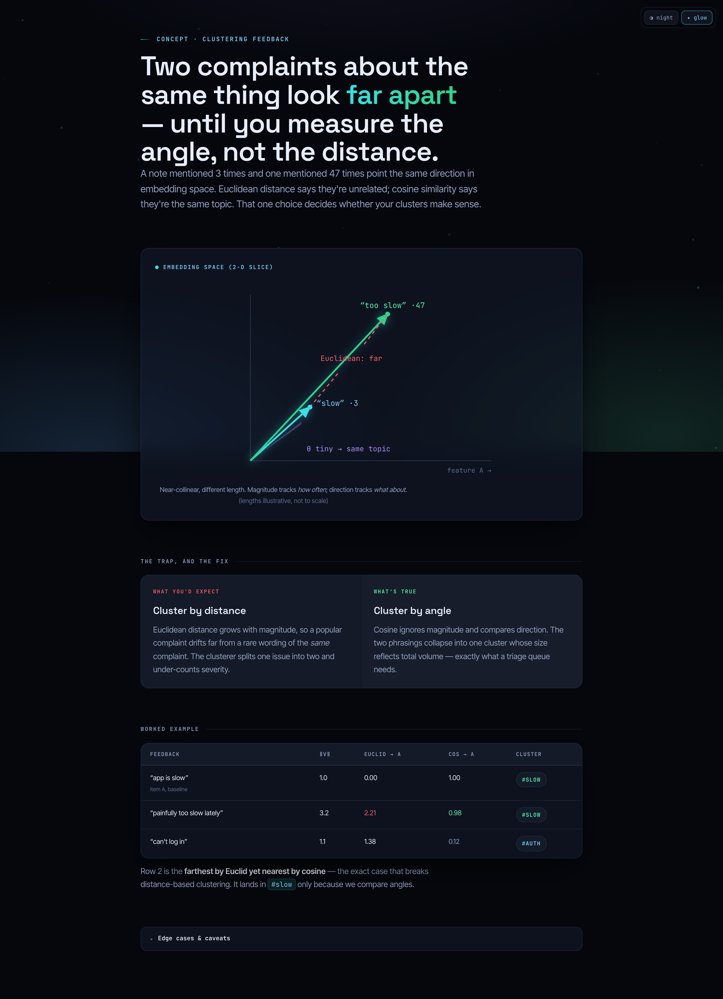
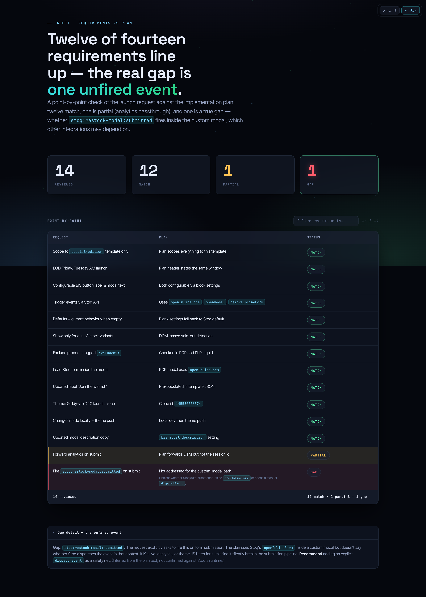
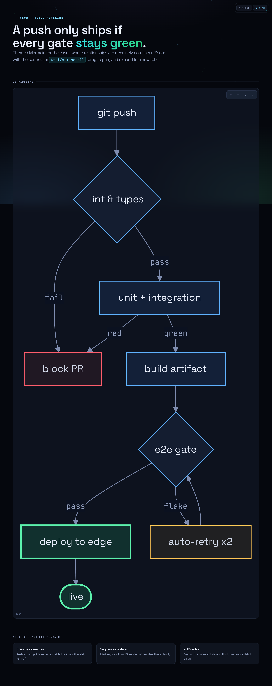
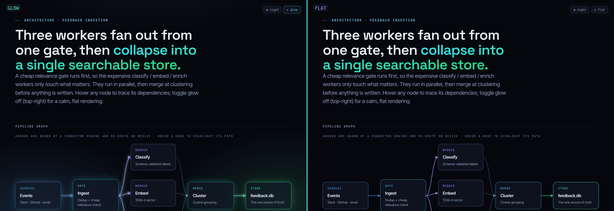

<p align="center">
  
</p>

<h1 align="center">UltraExplainer</h1>

<p align="center">
  <b>Turn code, systems, diffs, and plans into strikingly clear self-contained HTML.</b><br>
  Node-edge graphs with routed arrows · annotated diffs · dashboards · custom SVG illustrations · themed Mermaid · slide decks.<br>
  A futuristic <b>"Aurora"</b> design system with an <b>optional glow layer</b> and light/dark themes the reader can toggle.
</p>

<p align="center">
  <a href="LICENSE"></a>
  
  
</p>

---

Ask your coding agent to explain an architecture, review a diff, audit a plan, or teach a concept. Instead of ASCII art and wrapped terminal tables, UltraExplainer generates **one self-contained `.html` file** — real typography, routed connectors, charts, and custom illustrations — and opens it in your browser.

```
> /ultra-explain the auth request flow
> /diff-review main..HEAD
> /plan-review ~/docs/refactor-plan.md
> /dashboard recovery performance this month
> /concept why cosine similarity, not euclidean, clusters our feedback
> /slides the gateway migration
```

## Why another explainer?

Every coding agent defaults to box-drawing characters the moment you ask for a diagram, and to pipe-and-dash walls the moment you ask for a table. UltraExplainer is built to be **decisively better than that — and better than the generic clean-card HTML explainers that already exist** — on two axes:

- **A real design system, not a theme.** *Aurora* is a dark/light glass aesthetic where **glow is a budgeted, optional layer you can toggle off** (`✦ glow` / `○ flat` in the corner of every page). The identity is *clarity + visualization variety* — node-edge graphs with arrows that re-route on resize, annotated diffs with comment connectors, KPI dashboards with charts, hand-built SVG illustrations — not a wall of identical cards, and not cheap uniform neon.
- **A reasoning method, not just rendering.** Before drawing, the skill writes a one-line *charter*, forms a *thesis with tension*, harvests evidence into a *ledger with anchors and confidence*, runs a *reconcile gate* (the thesis must bend to contradicting evidence or show it), tiers everything by *salience* (≤3 things in the first viewport), picks the *lowest-ink representation*, and runs an *in-loop fact-check* against the real source. Pretty-but-wrong is treated as a failed deliverable.

> UltraExplainer is an independent, from-scratch project inspired by the excellent [`visual-explainer`](https://github.com/nicobailon/visual-explainer) by nicobailon. It shares the "self-contained HTML, opens in your browser" spirit and goes further on visual design and synthesis rigor.

## Gallery

<table>
  <tr>
    <td width="50%"><br><sub><b>Architecture</b> — node-edge graph with routed arrows + hover-to-trace</sub></td>
    <td width="50%"><br><sub><b>Diff review</b> — annotated diff, comment connector, verdict, blast radius</sub></td>
  </tr>
  <tr>
    <td><br><sub><b>Dashboard</b> — focal-glow KPIs, area/donut/bar charts</sub></td>
    <td><br><sub><b>Concept</b> — custom SVG illustration + naive-vs-correct + worked example</sub></td>
  </tr>
  <tr>
    <td><br><sub><b>Audit table</b> — live filter + status badges</sub></td>
    <td><br><sub><b>Mermaid</b> — Aurora-themed flowcharts with zoom/pan</sub></td>
  </tr>
</table>

<p align="center"><sub>Every page ships a corner switcher: <b>◑ night / ◐ day</b> and <b>✦ glow / ○ flat</b>. Below: the same page, glow vs flat.</sub></p>

<p align="center">
  
</p>

## Install

### Claude Code (recommended)

```
/plugin marketplace add hookdump/UltraExplainer
/plugin install ultra-explainer@ultraexplainer
```

Then restart, and the `ultra-explainer` skill plus the commands (`/ultra-explain`, `/diff-review`, `/plan-review`, `/dashboard`, `/concept`, `/slides`, `/web-diagram`, `/project-recap`, `/fact-check`) are available. The skill also triggers automatically when you ask for a diagram, review, dashboard, or visual explanation.

### Other harnesses

| Harness | How |
|---|---|
| **Codex CLI** | Copy `plugins/ultra-explainer` to `~/.codex/skills/ultra-explainer`; see `configs/codex/AGENTS.md` |
| **OpenCode** | Copy `plugins/ultra-explainer` to `~/.config/opencode/skill/ultra-explainer`; see `configs/opencode/AGENTS.md` |
| **Cursor** | Add `configs/cursor/ultra-explainer.mdc` to your project rules |
| **Anything else** | Point your agent at `plugins/ultra-explainer/SKILL.md` |

No build step, no runtime dependencies — output is a single HTML file that opens in any browser.

## Commands

| Command | Does |
|---|---|
| `/ultra-explain <thing>` | Explain any system, file, change, or idea — picks the right representation |
| `/diff-review [range]` | Visual diff/PR review: decisive hunks, behavioral delta, blast radius, verdict |
| `/plan-review <plan>` | Audit a plan/requirements against the codebase, point by point |
| `/dashboard <metrics>` | Metrics dashboard: focal KPI + the leanest charts |
| `/concept <topic>` | Teach a mechanism with a custom SVG illustration + worked example |
| `/web-diagram <thing>` | A standalone node-edge graph or themed Mermaid diagram |
| `/slides <topic>` | A full-viewport slide deck |
| `/project-recap` | A context-switch recap from git history + the code |
| `/fact-check <page>` | Re-verify a generated page against the live source |

## The Aurora design system

- **Themes & glow are independent toggles.** `data-theme="dark|light"` and `data-fx="glow|flat"`, resolved before first paint (no flash) and persisted per reader. Flat mode keeps the glass, depth, color, and connectors — it just removes the bloom, for a calm, docs-clean look.
- **Glow is a function, not decoration.** It's a finite budget spent only on the active narrative path, the single most important state/answer, and key metrics — routed through `--fx-*` variables so the toggle is a clean switch.
- **A real visualization vocabulary.** A connector engine that routes bezier arrows between arbitrary nodes (and re-routes on resize), a diff component with comment connectors, KPI/area/bar/donut charts in pure CSS+SVG, a custom-SVG illustration pattern, timelines, comparison panels, tabs, live-filter tables, collapsibles, and an Aurora-themed Mermaid shell with zoom/pan.
- **Robust by default.** Self-contained, responsive to 360px, no horizontal scroll, `prefers-reduced-motion` and `prefers-color-scheme` respected, visible keyboard focus, and a system-font fallback so a blocked webfont never breaks the layout.

See [`plugins/ultra-explainer/references/design-system.md`](plugins/ultra-explainer/references/design-system.md) and [`components.md`](plugins/ultra-explainer/references/components.md).

## How it's built

```
plugins/ultra-explainer/
├── SKILL.md                  # the skill: method + routing + invariants
├── commands/                 # 9 slash-command modes
├── references/               # design-system, components, synthesis-method, mermaid, slides, self-contained
├── templates/                # 7 self-contained example pages (the build output)
│   └── _src/                 # body fragments + per-template head/foot sidecars
└── assets/
    ├── aurora.css            # the canonical design system (single source of truth)
    └── aurora.js             # connector engine, theme/glow switcher, tabs, filters, particles
```

Templates are assembled from the canonical assets so the look stays consistent:

```bash
node scripts/build-templates.mjs   # inlines aurora.css + aurora.js into each templates/<name>.html
```

The generated templates are fully self-contained — open them straight from disk.

## License

MIT © [hookdump](https://github.com/hookdump). Inspired by [nicobailon/visual-explainer](https://github.com/nicobailon/visual-explainer) (also MIT).
